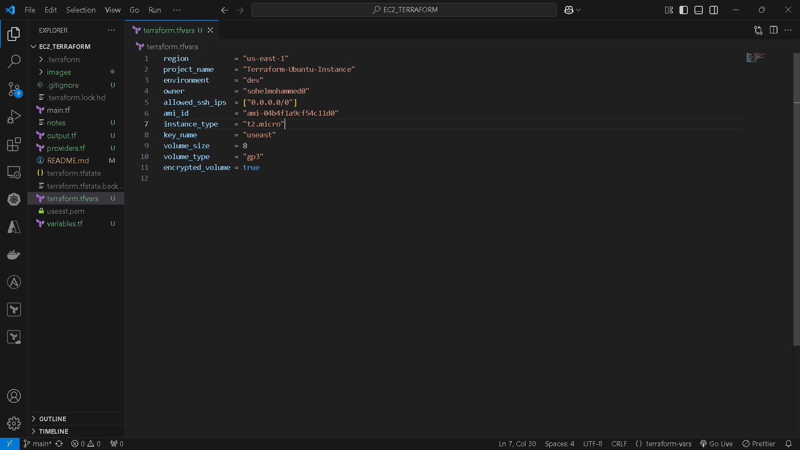

# Terraform EC2 Instance Deployment Guide

This repository contains the Terraform configuration to deploy an Ubuntu EC2 instance on AWS. Terraform is a powerful tool for infrastructure as code, offering advantages like reusability of configurations, scalability across various environments, and state management for consistent deployments. The steps are simple, allowing even non-DevOps users to follow along and deploy an instance effortlessly.

## Features
- Fully dynamic configuration, reducing manual errors by automating the setup process.
- All settings controlled via `terraform.tfvars`, making it easy to customize deployments.
- Ubuntu 20.04 LTS instance (Free Tier eligible), ensuring compatibility and cost-efficiency.
- SSH and HTTP access configured for seamless remote connectivity.
- Encrypted root volume, enhancing data security and compliance with best practices.

## Prerequisites

1. **AWS Account**: Sign up at [AWS Console](https://aws.amazon.com/).
2. **AWS CLI**: Install and configure it using:
   ```bash
   aws configure
   ```
   Replace with your AWS access key, secret key, and region.
3. **Terraform**: Install Terraform from the [official website](https://www.terraform.io/).

## Repository Contents

| File            | Description                                  |
|-----------------|----------------------------------------------|
| `main.tf`       | Main configuration for AWS EC2 and resources. |
| `variables.tf`  | Variables for dynamic input.                 |
| `outputs.tf`    | Outputs like instance ID, public IP, SSH command. |
| `terraform.tfvars` | User-defined values for variables.        |

## Deployment Steps

### 1. Clone the Repository
Clone this repository to your local machine:

```bash
git clone https://github.com/sohelmohammed0/EC2_TERRAFORM
cd EC2_TERRAFORM
```


### 2. Initialize Terraform
Initialize Terraform to download required providers and set up the project:

```bash
terraform init
```


### 3. Configure `terraform.tfvars`

Ensure you have your `.pem` key file ready and accessible. This file is essential for SSH access to the instance and must be kept secure. For convenience, save the `.pem` file in a known location and restrict its permissions using:

```bash
chmod 400 your-key-name.pem
```

Edit the `terraform.tfvars` file to customize your deployment:

```hcl
region           = "us-east-1"
project_name     = "Terraform-Ubuntu-Instance"
environment      = "dev"
owner            = "your-name"
allowed_ssh_ips  = ["0.0.0.0/0"] # Replace with your IP for better security
ami_id           = "ami-08c40ec9ead489470" # Ubuntu 20.04 LTS
instance_type    = "t2.micro"
key_name         = "your-key-name"
volume_size      = 8
volume_type      = "gp3"
encrypted_volume = true
instance_count   = 2 # Specify the number of instances to deploy

```


### 4. Preview the Deployment
Run the following command to preview the resources Terraform will create:

```bash
terraform plan
```


### 5. Apply the Configuration
Deploy the EC2 instance using:

```bash
terraform apply
```
Type `yes` when prompted.


### 6. Retrieve Instance Details
After successful deployment, Terraform will display:

- Instance IDs
- Public IPs
- SSH Commands

Example output:

```makefile
Apply complete! Resources: 1 added, 0 changed, 0 destroyed.

Example Outputs:

instance_id = "i-xxxxxxxxxxxxxxxxx"
instance_public_ip = "3.xx.xxx.xx"
ssh_command = "ssh -i your-key-name.pem ubuntu@3.xx.xxx.xx"
```


### 7. Connect to the EC2 Instance

Use the SSH commands from the outputs to connect to the instances:

```bash
ssh -i your-key-name.pem ubuntu@<Public_IP>
```

> **Note:** Ensure your `.pem` key file is secured by restricting its permissions to prevent unauthorized access. Use the following command to set appropriate permissions:
>
> ```bash
> chmod 400 your-key-name.pem
> ```

Use the SSH command from the outputs to connect to the instance:

```bash
ssh -i your-key-name.pem ubuntu@<Public_IP>
```

### 8. Destroy the Instance (Optional)
To delete all resources created by Terraform, run:

```bash
terraform destroy
```
Type `yes` when prompted.


## Notes

- **Free Tier Eligibility**: Ensure you use the `t2.micro` instance type and eligible Ubuntu AMI.
- **Security**: Replace `allowed_ssh_ips` in `terraform.tfvars` with your IP range for secure access.
- **AWS Billing**: Monitor AWS usage to avoid unexpected charges.

## Troubleshooting

- If `terraform init` fails, ensure your internet connection is stable and AWS CLI is configured correctly.
- If the SSH connection fails, check your security group settings and ensure the correct key pair is used.
- If you encounter an error related to insufficient IAM permissions, verify that your AWS user has the necessary policies attached to manage EC2 and related resources.
- If Terraform fails due to a region mismatch, ensure that the `region` in `terraform.tfvars` matches the region configured in your AWS CLI. If `terraform init` fails, ensure your internet connection is stable and AWS CLI is configured correctly.
- If the SSH connection fails, check your security group settings and ensure the correct key pair is used.

## Contributing

Feel free to fork the repository and make improvements. Contributions are always welcome!

To maintain consistency and quality, consider following the contribution guidelines outlined in the [CONTRIBUTING.md](./CONTRIBUTING.md) file. It includes instructions on submitting issues, creating pull requests, and adhering to coding standards. to fork the repository and make improvements. Contributions are always welcome!

## License

This project is licensed under the MIT License. See the LICENSE file for details.
